## 한자리씩 처리하기(정방향) (01)

## A1 코드와 결과 값 입니다.
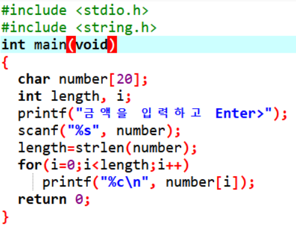
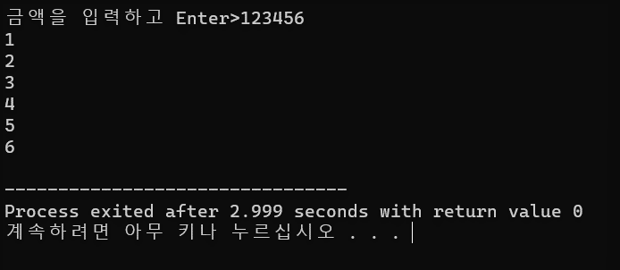

## 한자리씩 처리하기(역방향) (02)

## A2 코드와 결과 값 입니다.
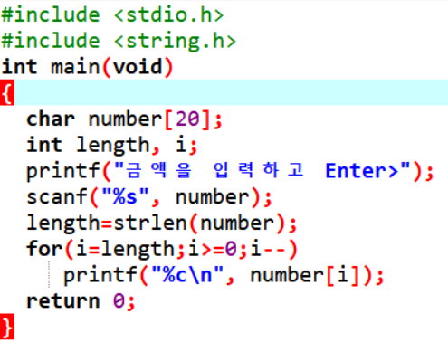
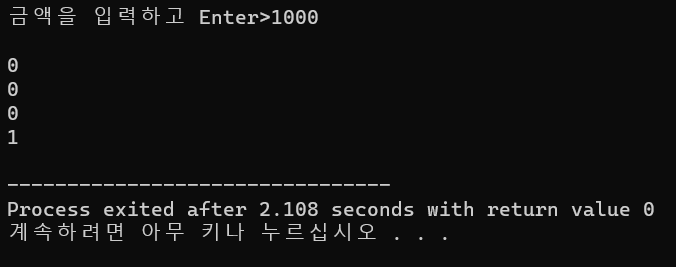

## 높은 단위 + 낮은 단위 출력 (03)

## A3 코드와 결과 값 입니다.
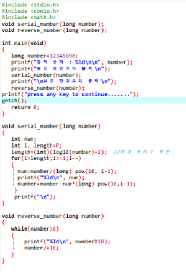
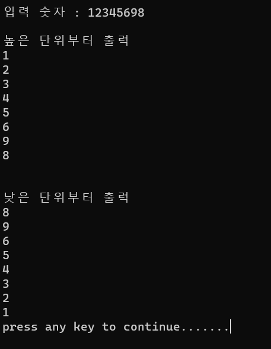

## 높은 단위 + 낮은 단위 출력(재귀적) (04)

## A4 코드와 결과 값 입니다.
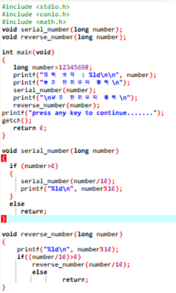
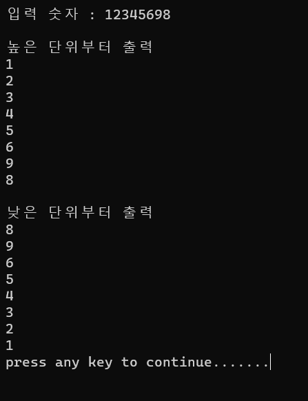

## 디지털 숫자 표시하기 (05)

## A5 코드에 대한 결과 값 입니다.
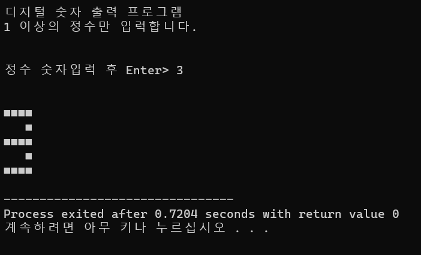

## 콘솔 환경에서 수평 및 수직 슬라이드바를 그림 및 조작 (06)

## A6 코드에 대한 결과 값 입니다.
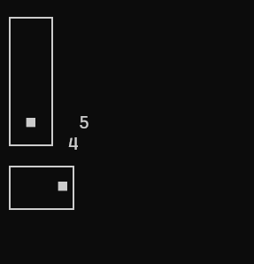

## 테트리스 게임 만들기 (07)

## A7 코드에 대한 결과 값 입니다.
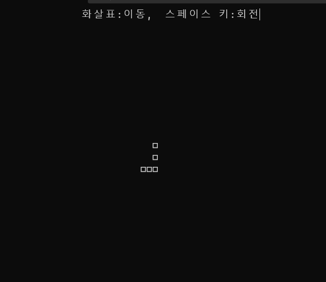

## 오늘 교수님 설명중
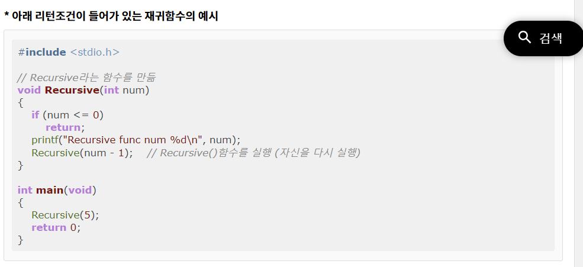
